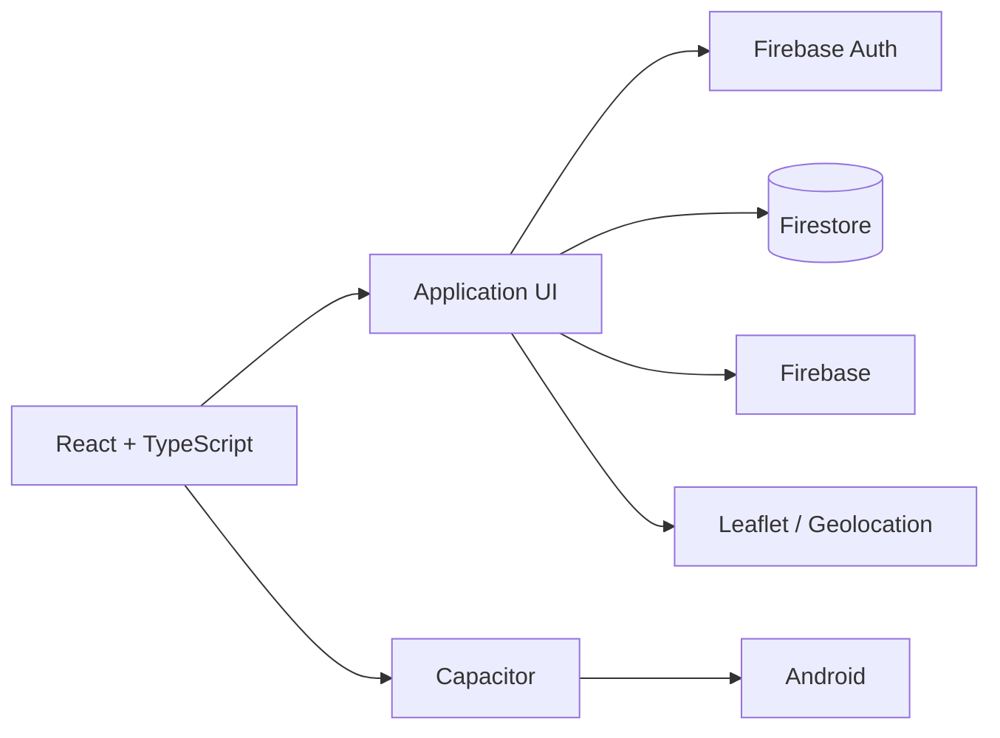

# Bricola — Local Services Marketplace 🇹🇳🛠️

> A mobile-first marketplace connecting customers in Tataouine with local artisans such as plumbers, electricians, carpenters, and other service professionals.

Bricola is a full-stack product prototype designed around a simple local-services problem: make it easier for customers to discover qualified artisans, request services, communicate, and track service interactions from one application.

## Product overview

Bricola supports two main user experiences:

**Customers** can:

- discover nearby artisans;
- search by service;
- submit service requests;
- communicate through realtime chat;
- track requests;
- rate completed services.

**Artisans** can:

- manage their professional profile;
- switch availability status;
- receive realtime notifications;
- manage incoming service requests;
- communicate with customers;
- work with location-aware requests.

## Key features

- 🔐 **Role-based onboarding** — separate customer and artisan flows.
- 💬 **Realtime chat** — Firebase-backed communication between users.
- 🔔 **Realtime notifications** — service-request updates and artisan activity.
- 📍 **Geolocation** — location-aware artisan discovery and service requests.
- ⭐ **Ratings** — rolling rating calculation for artisans.
- 🌐 **Internationalization** — Arabic plus French/English support.
- 📱 **Android application** — web application packaged through Capacitor.
- 📴 **Availability state** — artisans can communicate whether they are currently available.

## Architecture



## Tech stack

| Layer | Technology |
|---|---|
| Frontend | React + TypeScript |
| Build tool | Vite |
| Mobile runtime | Capacitor |
| Backend services | Firebase |
| Database | Cloud Firestore |
| Authentication | Firebase Auth |
| Styling | Tailwind CSS |
| Maps | Leaflet |
| Target mobile platform | Android |

## Engineering highlights

The project demonstrates more than a static frontend. It combines:

- realtime application state;
- authentication and user roles;
- geospatial UI and location-aware workflows;
- asynchronous service-request flows;
- realtime messaging;
- mobile packaging from a web codebase;
- multilingual user interfaces including Arabic/RTL requirements.

These areas make Bricola useful as a full-stack/mobile engineering case study.

## Project structure

The repository is organized around the React/Vite application and its Capacitor Android target. Firebase is used as the backend service layer for authentication, persistence, and realtime application data.

## Getting started

### Requirements

- Node.js
- npm
- Android Studio for Android builds
- A Firebase project configured for the application

### Installation

```bash
git clone https://github.com/Mossaabjelliti/Bricola.git
cd Bricola
npm install
npm run dev
```

### Android build

Build the web application:

```bash
npm run build
```

Synchronize Capacitor:

```bash
npx cap sync
```

Open the Android project:

```bash
npx cap open android
```

## Configuration

Firebase credentials and other environment-specific values should be supplied through the project's environment/configuration mechanism rather than committed to source control.

## Current status

Bricola is a product prototype demonstrating a local-services marketplace architecture. Further production work would include stronger automated testing, backend security-rule auditing, notification reliability, service-request lifecycle hardening, and production deployment/monitoring.

## Roadmap

- [ ] Add comprehensive unit and integration tests
- [ ] Harden Firestore security rules
- [ ] Improve service-request state machine
- [ ] Add production notification infrastructure
- [ ] Add automated deployment
- [ ] Add analytics and operational monitoring

## Author

**Mossaab Jelliti**

Full-stack and software engineering portfolio project focused on practical digital products for the Tunisian market.

- GitHub: [@Mossaabjelliti](https://github.com/Mossaabjelliti)
